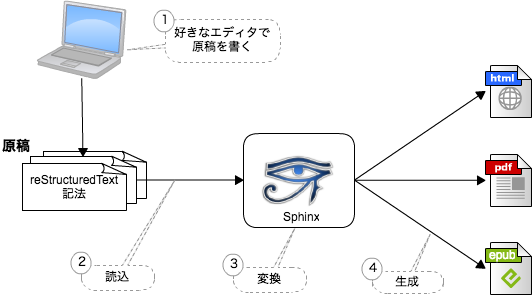

Sphinxサイト ミーティング 6/30
===============================
* 日時: 2017/06/30 10:00 - 12:00
* 参加者: shimizukawa, tk0miya, usaturn, r_rudi

進捗状況について
-----------------
まず進捗状況の共有を行いました。
前回ミーティング [Sphinxサイト ミーティング 5/13](meeting-0513.html)
からの進捗確認。

* サイト概要: 未着手
* Sphinの紹介: 大まかに完了。 *肉付けと見直しが必要*
* インストールページ: **完了**

<!--
公式ドキュメント翻訳については省略
-->

### 検討課題

1. Sphinxの紹介で、以下の絵のような、Sphinxの全体像を
   表すイメージ図が必要

   

2. [sphinx-doc.org] の紹介とリンクを追加しよう

3. [進捗状況について](#進捗状況について) で確認したような進捗を自動的に
   確認する方法

議事録に補足があればbitbucketの
[ここ](https://bitbucket.org/user/path) でコメントを
付けてください。

[sphinx-doc.org]: http://sphinx-doc.org/
